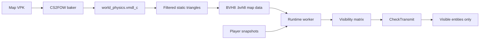

# CS2FOW

Server-side fog-of-war visibility culling for Counter-Strike 2.

CS2FOW helps reduce what wallhacks can reveal by stopping hidden enemies from
being transmitted to clients when static map geometry blocks visibility. It is a
native Metamod plugin with an offline baker. It does not use engine TraceRay for
runtime visibility.

## What It Does

- Uses real CS2 map physics data.
- Bakes static world geometry into a BVH8 acceleration structure.
- Uses AVX to test multiple BVH boxes at once.
- Runs visibility work away from the main game thread.
- Keeps `CheckTransmit` cheap: it only reads the finished visibility matrix.
- Automatically bakes missing data for official, custom, and Workshop maps when
  the server has the map mounted.



## Install

1. Install Metamod:Source for CS2.
2. Download the CS2FOW package for your server platform:
   - `cs2fow-0.1.0-preview-windows-x86_64.zip`
   - `cs2fow-0.1.0-preview-linux-x86_64.zip`
3. Extract the zip into your CS2 `game/csgo` folder.
4. Start the server.
5. Run:

```text
cs2fow_status
```

If the current map data is missing, CS2FOW starts a low-priority background bake.
After a few seconds, the map data is ready and CS2FOW activates for that map.

Official map prebakes are available as an optional separate download:

```text
cs2fow-0.1.0-preview-official-maps.zip
```

Install that zip into `game/csgo` if you want official maps to activate without
first-load baking.

## Hardware Requirement

CS2FOW requires AVX CPU support. Most CPUs from around 2012 and newer support
AVX, but some VDS providers hide or disable it inside the virtual machine. If
CS2FOW does not activate, check AVX support with a tool like CPU-Z.

## Configuration

Defaults live in `cfg/cs2fow.cfg`:

```text
cs2fow_enable 1
cs2fow_update_interval_ms 10
cs2fow_max_lookahead_ms 210
cs2fow_min_lookahead_ms 120
cs2fow_peek_margin_units 21
cs2fow_visibility_hold_ms 150
cs2fow_debug 0
```

`cs2fow_status` reports active/disabled state, map CRC, bake version, triangle
counts, worker timings, result age, evaluated pairs, visible totals, hidden
totals, and automatic bake progress.

## Map Baking

The packaged baker is used automatically by the plugin, but it can also be run
manually:

```text
cs2fow_baker --game <cs2-root> --map de_dust2 --output de_dust2.bvh8
```

Use `--vpk <path>` for a mounted custom or Workshop addon VPK. Workshop addons
containing `maps/<map>.vpk` are extracted automatically.

Generated map data is derived from Counter-Strike 2 game data and is covered by
`DATA_NOTICE`, not the MIT project license.

## Build

The build expects Metamod:Source and HL2SDK CS2 references. The local defaults
match this workspace layout:

```text
mkdir build
cd build
python ../configure.py
ambuild
```

Then package:

```text
python package.py
```

## Known Limits

- Static map geometry only.
- No smoke, doors, breakables, projectiles, particles, props, or other dynamic
  blockers.
- No scalar fallback; AVX is required.
- CS2 updates may require gamedata updates.

## License

Project code is MIT licensed. See `LICENSE`, `THIRD_PARTY_NOTICES`, and
`DATA_NOTICE`.
