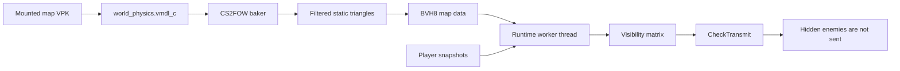

<div align="center">

# [CS2FOW]
(Counter-Strike 2 Fog Of War)
### Server-sided anti-wallhack occlusion culling for Counter-Strike 2 servers

[](https://github.com/karola3vax/CS2FOW/releases/latest)
[](https://github.com/karola3vax/CS2FOW/releases)
[](https://github.com/karola3vax/CS2FOW/issues)
[](LICENSE)
[](https://github.com/karola3vax/CS2FOW/commits/main)

</div>

<div align="center">


</div>

## FAQ

These are the top repeated questions from Reddit, Discord, GitHub, and live
server testing.

### What is CS2FOW?

CS2FOW is a server-side anti-wallhack plugin for Counter-Strike 2 community
servers.

If an enemy is fully hidden behind solid map geometry, CS2FOW can stop sending
that enemy's live entity data to the client. If the client never receives the
hidden enemy position, a wallhack has much less useful data to draw.

It is not a visual filter. It does not hide pixels on the player's PC. It runs
on the server and controls which enemy entities are transmitted.

### Does this work on Valve matchmaking or Premier, and can players get VAC banned?

No. CS2FOW is a Metamod server plugin for community and dedicated servers.
Players do not install it, and it cannot be used on Valve official matchmaking
unless Valve implements something similar inside the game.

There is no expected VAC risk from CS2FOW itself. It runs on the server, does
not modify client files, does not inject into the client, and does not ask
players to install anything.

### Can cheats bypass this?

Not in the usual "update the cheat" way.

If the server sends enemy positions, cheats can read them. If the server does
not send hidden enemy positions, a cheat cannot recover exact live data it never
received.

Cheats can still use weaker signals such as sound events, last-known positions,
common prefire spots, teammate information, or game sense. CS2FOW reduces the
main wallhack data source; it does not make cheating impossible.

### Does this make the server heavy or run checks every tick?

In testing, no meaningful overhead was observed.

The expensive map work is done ahead of time or in a low-priority background
bake. Runtime checks use pre-baked BVH8 data and AVX math instead of engine
TraceRay spam.

In a tested 12v12 worst-case scenario, the old trace-based approach could hit
around `60ms`. CS2FOW averaged around `1ms`, with worst cases around `8ms`.

`CheckTransmit` only reads the finished visibility matrix. BVH traversal, ray
math, file IO, locks, and baking do not run inside the hot transmit hook.

CS2FOW does not calculate visibility every tick. A worker thread refreshes the
visibility matrix on an interval. The default is `10ms`. Old snapshots are
replaced instead of queued.

The worst case is more directed enemy pairs, especially if everyone is an
enemy.

CS2FOW was designed for that shape of work: pre-baked map data, BVH8 traversal,
AVX packet math, a worker thread, early exits, and cached triangle packets.
Server owners should still test their own maps and player counts with
`cs2fow_status`.

### Does it add delay or make peeking feel bad?

That is the main tradeoff, so CS2FOW intentionally reveals early.

It uses player movement, ping, a minimum lookahead window, and a short hold time
to avoid late pop-in. Higher-ping players can receive a larger early-reveal
buffer, capped by configuration.

The preview is tuned to prefer a small near-corner information leak over hiding
an enemy too late.

### Can I still wallbang hidden enemies?

Yes.

The enemy still exists normally on the server. Hit registration, bullet
penetration, damage, movement, and game rules still happen server-side. CS2FOW
only changes whether that enemy entity is transmitted to a specific client.

### What exactly is hidden?

In the current preview, CS2FOW filters living enemy pawns and their obvious
visual group from living T/CT recipients.

Dead players, spectators, HLTV, teammates, self, projectiles, dropped world
items, particles, effects, and sounds are not filtered. Bots are treated like
normal players when they are alive enemies.

### Does it block radar cheats, sound ESP, or other information leaks?

Partly.

If a radar cheat depends on enemy entity positions sent by the server, CS2FOW
reduces that data too. Hidden enemies are not transmitted, so there is less
live position data to draw.

It does not currently hide sound events, teammate information, bomb
information, dropped weapon clues, or every possible world clue. Sounds are
separate events, and changing them would affect legitimate players too.

### What about smokes, doors, breakables, props, and weapon pop-in?

The current preview uses static baked map geometry only.

Dynamic occluders such as smokes, doors, breakables, props, particles, and
projectiles need different handling. They are intentionally out of scope until
they can be handled without breaking normal gameplay.

The preview also checks player body visibility, not every held weapon muzzle.
Weapon muzzle or weapon-bounds samples are planned so a player can be revealed
early when the held weapon becomes visible first.

### How accurate is it, and why not just use PVS or engine TraceRay?

Spatially, CS2FOW uses the real CS2 map physics resource, not a hand-made map.
The baker extracts static world collision triangles from the mounted map, builds
a BVH8 acceleration structure, and the runtime checks multiple observer and
target points against that geometry.

It is accurate for solid static walls, floors, corners, and normal map cover.
It is not a full simulation of every dynamic gameplay object.

PVS is very cheap, but it is area-based and too loose for anti-wallhack. It can
leak far more than a real visibility check.

Engine TraceRay can be accurate, but doing many traces for every player pair is
expensive. CS2FOW avoids that by baking map geometry once and using BVH8 + AVX
ray math in its own worker thread.

## Troubleshooting

### Why does my VDS say AVX is missing?

Some VDS providers hide CPU features from the virtual machine.

Even if the physical CPU supports AVX, the guest OS may not expose AVX or OS
AVX state. Check with CPU-Z, `lscpu`, or your host provider.

### What does automatic map baking do?

If the current map has no valid `.bvh8` file, CS2FOW starts the packaged baker
in the background at low priority.

The server stays playable and fail-open while baking. After the bake validates,
CS2FOW can activate during the same map session.

### Does auto-baking support Workshop maps?

Yes, if CS2 has mounted the map and the server can read the VPK.

CS2FOW resolves the mounted map VPK, including Workshop addon VPKs that contain
a nested `maps/<map>.vpk`, then bakes from that source.

### Why ship optional official map prebakes?

Convenience and hostile hosting environments.

Auto-baking should work for normal installs, but some Linux permissions, panel
setups, or VDS policies can block background executables. Optional prebakes let
server owners install official map data without running the baker on first
load.

### What happens if Valve updates a map?

CS2FOW validates the map source before using a bake.

The bake stores the source physics CRC and size. On map load, CS2FOW compares
the current map source with the baked source. If they do not match, the bake is
rejected and CS2FOW fails open until a new bake is generated.

For nested Workshop map packages, the nested map VPK source is also tracked.

### What does fail-open mean?

If CS2FOW is not sure, it shows players normally.

Missing map data, corrupt bakes, wrong CRCs, unsupported CPU features, stale
worker results, failed hooks, and baking-in-progress states should never hide
players incorrectly.

### Why did Linux report `GLIBCXX_3.4.32 not found`?

Older Linux packages were built against a newer libstdc++ than some SteamRT3
servers provide.

`v0.1.1-preview` rebuilt Linux artifacts against Valve's SteamRT3 Sniper SDK and
added ABI checks for that runtime baseline.

### Why did Linux report `automatic bake failed: Permission denied`?

The server likely could not execute the packaged baker or VRF binary.

Check executable permissions on Linux:

```sh
chmod +x game/csgo/addons/cs2fow/bin/cs2fow_baker
chmod +x game/csgo/addons/cs2fow/tools/vrf/*
```

Also check whether the hosting panel, container, mount options, or provider
policy blocks executing files from the server directory.

### What is gamedata for?

Gamedata stores small platform-sensitive offsets used by the plugin.

CS2FOW needs these for things like reading the CheckTransmit recipient slot and
resolving the entity system. If CS2 changes those layouts, gamedata may need an
update.

### What should I include in a bug report?

Include:

- CS2FOW version.
- Windows or Linux.
- Dedicated server, panel, container, or VDS provider.
- Map name.
- `cs2fow_status` output.
- Server console log around plugin load and map start.
- Whether the issue happens while alive, dead, spectating, or on bots.
- A short clip if the report is about pop-in or visibility.

## How It Works

**If the enemy is fully behind solid map geometry, the cheat has no enemy data
to draw.**

CS2FOW is not a visual filter. It is server-side visibility culling. The plugin
uses the real CS2 map physics resource, bakes static world triangles into a
BVH8 acceleration structure, then uses AVX math on a worker thread to decide
which enemy pawns should be transmitted to each player. `CheckTransmit` only
reads the finished visibility matrix.



<div align="center">


</div>

## Why CS2FOW

Traditional server-side anti-wallhack approaches often rely on expensive engine
TraceRay checks. CS2FOW avoids that runtime cost by doing the heavy map work
offline or in a low-priority background bake, then using the baked BVH8 data at
runtime.

In a 12v12 worst-case test, the old trace-based approach could hit around
`60ms`. CS2FOW averaged around `1ms`, with worst cases around `8ms`.

**That is up to 50x faster in the tested scenario.**

## Quickstart

<table width="100%">
<tr>
<td width="33%"><b>1. Pick your core package</b><br><br>
Windows:<br>
<code>cs2fow-0.1.2-preview-windows-x86_64.zip</code><br><br>
Linux:<br>
<code>cs2fow-0.1.2-preview-linux-x86_64.zip</code>
</td>
<td width="33%"><b>2. Extract into CS2</b><br><br>
Extract the package into your server's:<br><br>
<code>game/csgo</code><br><br>
Metamod:Source for CS2 must already be installed.
</td>
<td width="33%"><b>3. Start and check</b><br><br>
Start the server, load a map, then run:<br><br>
<code>cs2fow_status</code>
</td>
</tr>
</table>

Download from the latest release:

https://github.com/karola3vax/CS2FOW/releases/latest

The optional official map prebakes from `v0.1.0-preview` remain compatible:

```text
cs2fow-0.1.0-preview-official-maps.zip
```

Install that zip into `game/csgo` if you want official maps to activate without
first-load baking.

## Automatic Map Baking

If map data is missing or outdated, CS2FOW starts a low-priority background bake
for the current mounted map. The server stays playable while this happens.
After the bake validates, CS2FOW activates for that map during the same session.

This supports official maps, custom maps, and Workshop maps as long as CS2 has
the map mounted and the `addons/cs2fow/data/maps` folder is writable.

## Hardware Requirement

CS2FOW requires AVX CPU support and OS AVX state support. Most CPUs from around
2012 and newer support AVX, but some VDS providers hide or disable it inside
the virtual machine. If CS2FOW does not activate, check AVX support with CPU-Z
or a similar tool.

## Configuration

Defaults live in `cfg/cs2fow.cfg`:

```text
cs2fow_enable 1
cs2fow_update_interval_ms 1
cs2fow_max_lookahead_ms 500
cs2fow_min_lookahead_ms 200
cs2fow_peek_margin_units 64
cs2fow_visibility_hold_ms 50
cs2fow_debug 0
```

`cs2fow_status` reports active or disabled state, map CRC, bake version,
triangle counts, worker timings, result age, evaluated pairs, visible totals,
hidden totals, and automatic bake progress.

## Manual Baker

The packaged baker is used automatically by the plugin, but it can also be run
manually:

```text
cs2fow_baker --game <cs2-root> --map de_dust2 --output de_dust2.bvh8
```

Use `--vpk <path>` for a mounted custom or Workshop addon VPK. Workshop addons
containing `maps/<map>.vpk` are extracted automatically.

Generated map data is derived from Counter-Strike 2 game data and is covered by
`DATA_NOTICE`, not the MIT project license.

## Build From Source

The build expects Metamod:Source and HL2SDK CS2 references. The local defaults
match this workspace layout:

```text
mkdir build
cd build
python ../configure.py
ambuild
```

Then package:

```text
python package.py
```

GitHub Actions builds and tests Windows and Linux packages on every push.

## Known Limits

- Static map geometry only.
- No smoke, doors, breakables, projectiles, particles, props, or other dynamic
  blockers.
- No scalar fallback; AVX is required.
- CS2 updates may require gamedata updates.

## Support

Use GitHub Issues for bug reports and feature requests:

https://github.com/karola3vax/CS2FOW/issues

## License

Project code is MIT licensed. See `LICENSE`, `THIRD_PARTY_NOTICES`, and
`DATA_NOTICE`.
