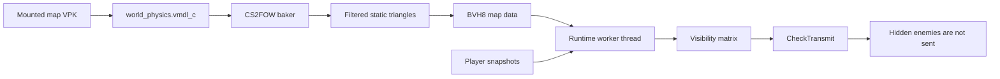

<div align="center">

# CS2FOW

### Server-sided anti-wallhack occlusion culling for Counter-Strike 2 servers

[](https://github.com/karola3vax/CS2FOW/releases/latest)
[](https://github.com/karola3vax/CS2FOW/releases)
[](https://github.com/karola3vax/CS2FOW/issues)
[](LICENSE)
[](https://github.com/karola3vax/CS2FOW/commits/main)

</div>

<div align="center">


</div>

## How It Works

**If the enemy is fully behind solid map geometry, the cheat has no enemy data
to draw.**

CS2FOW is not a visual filter. It is server-side visibility culling. The plugin
uses the real CS2 map physics resource, bakes static world triangles into a
BVH8 acceleration structure, then uses AVX math on a worker thread to decide
which enemy pawns should be transmitted to each player. `CheckTransmit` only
reads the finished visibility matrix.



## Why CS2FOW

Traditional server-side anti-wallhack approaches often rely on expensive engine
TraceRay checks. CS2FOW avoids that runtime cost by doing the heavy map work
offline or in a low-priority background bake, then using the baked BVH8 data at
runtime.

In a 12v12 worst-case test, the old trace-based approach could hit around
`60ms`. CS2FOW averaged around `1ms`, with worst cases around `8ms`.

**That is up to 50x faster in the tested scenario.**

## Quickstart

<table width="100%">
<tr>
<td width="33%"><b>1. Pick your core package</b><br><br>
Windows:<br>
<code>cs2fow-0.1.1-preview-windows-x86_64.zip</code><br><br>
Linux:<br>
<code>cs2fow-0.1.1-preview-linux-x86_64.zip</code>
</td>
<td width="33%"><b>2. Extract into CS2</b><br><br>
Extract the package into your server's:<br><br>
<code>game/csgo</code><br><br>
Metamod:Source for CS2 must already be installed.
</td>
<td width="33%"><b>3. Start and check</b><br><br>
Start the server, load a map, then run:<br><br>
<code>cs2fow_status</code>
</td>
</tr>
</table>

Download from the latest release:

https://github.com/karola3vax/CS2FOW/releases/latest

The optional official map prebakes from `v0.1.0-preview` remain compatible:

```text
cs2fow-0.1.0-preview-official-maps.zip
```

Install that zip into `game/csgo` if you want official maps to activate without
first-load baking.

## Automatic Map Baking

If map data is missing or outdated, CS2FOW starts a low-priority background bake
for the current mounted map. The server stays playable while this happens.
After the bake validates, CS2FOW activates for that map during the same session.

This supports official maps, custom maps, and Workshop maps as long as CS2 has
the map mounted and the `addons/cs2fow/data/maps` folder is writable.

## Hardware Requirement

CS2FOW requires AVX CPU support and OS AVX state support. Most CPUs from around
2012 and newer support AVX, but some VDS providers hide or disable it inside
the virtual machine. If CS2FOW does not activate, check AVX support with CPU-Z
or a similar tool.

## Configuration

Defaults live in `cfg/cs2fow.cfg`:

```text
cs2fow_enable 1
cs2fow_update_interval_ms 10
cs2fow_max_lookahead_ms 210
cs2fow_min_lookahead_ms 120
cs2fow_peek_margin_units 21
cs2fow_visibility_hold_ms 150
cs2fow_debug 0
```

`cs2fow_status` reports active or disabled state, map CRC, bake version,
triangle counts, worker timings, result age, evaluated pairs, visible totals,
hidden totals, and automatic bake progress.

## Manual Baker

The packaged baker is used automatically by the plugin, but it can also be run
manually:

```text
cs2fow_baker --game <cs2-root> --map de_dust2 --output de_dust2.bvh8
```

Use `--vpk <path>` for a mounted custom or Workshop addon VPK. Workshop addons
containing `maps/<map>.vpk` are extracted automatically.

Generated map data is derived from Counter-Strike 2 game data and is covered by
`DATA_NOTICE`, not the MIT project license.

## Build From Source

The build expects Metamod:Source and HL2SDK CS2 references. The local defaults
match this workspace layout:

```text
mkdir build
cd build
python ../configure.py
ambuild
```

Then package:

```text
python package.py
```

GitHub Actions builds and tests Windows and Linux packages on every push.

## Known Limits

- Static map geometry only.
- No smoke, doors, breakables, projectiles, particles, props, or other dynamic
  blockers.
- No scalar fallback; AVX is required.
- CS2 updates may require gamedata updates.

## Support

Use GitHub Issues for bug reports and feature requests:

https://github.com/karola3vax/CS2FOW/issues

## License

Project code is MIT licensed. See `LICENSE`, `THIRD_PARTY_NOTICES`, and
`DATA_NOTICE`.
